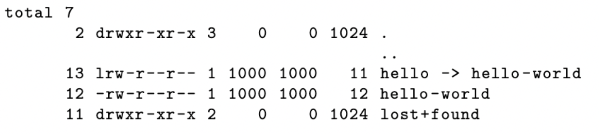

# Hey! I'm Filing Here

In this lab, I  implemented a 1 MiB ext2 file system with 2 directories, 1 regular file, and 1 symbolic link. The file system has 1 KiB sized blocks with space for 128 inodes. We are given the ext2 structures and some initial skeleton code which creates a file called cs111-base.img in the current working directory. From this, we create a valid ext2 filesystem:


## Building
To compile the executable
```bash
make
```

## Running
Run the executable to create cs111-base.img:
```bash 
./ext2-create
```

To dump the filesystem information to help debug:
```bash
dumpe2fs cs111 -base.img
```
This command checks that the filesystem is correct:
```bash 
fsck.ext2 cs111 -base.img
```
To create a directory to mnt your filesystem:
```bash
mkdir mnt
```
Mount your filesystem, loop lets you use a file:
```bash 
sudo mount -o loop cs111 -base.img mnt
```
Unmount the filesystem when you are done:
```bash
sudo umount mnt 
```
Delete the directory used for mounting when you are done
```bash
rmdir mnt
```

## Cleaning up
```bash
make clean
```

